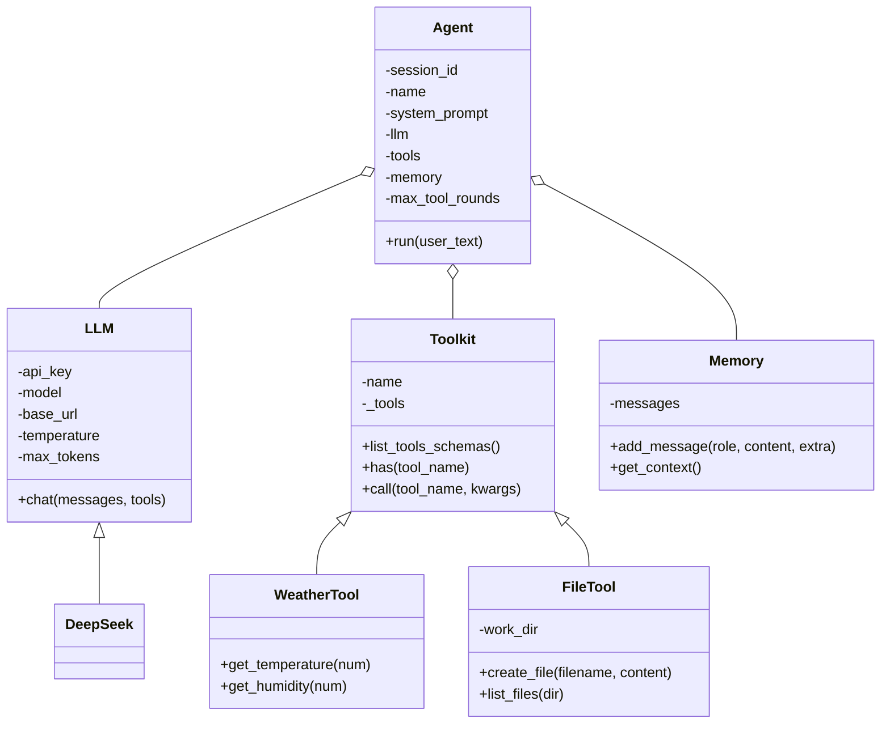
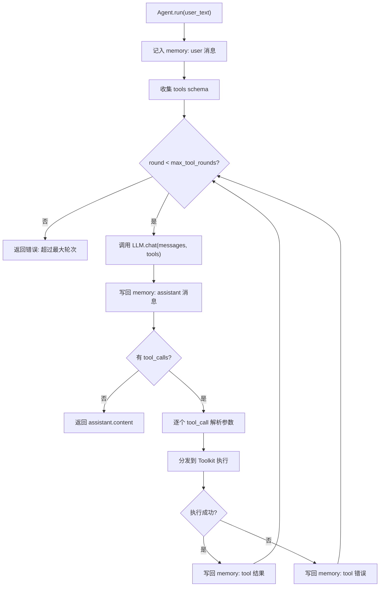

# 整体

**代码**: https://github.com/jihe520/learn-agent

一个 Agent 系统抽象出这几个最核心的类：Agent(代理) , Memory(记忆) , Tool（工具） , LLM（模型） 

当然还有Observation(观测)，Database(数据库)等辅助类，这些不影响核心功能，在此不添加过多理解门槛。


一切皆 Tool ，记住这句话，后面所有的实现都是 基于 Tool 展开的。




这是一个简单的 Agent 类的定义：
```python
class Agent:
    def __init__(
        self,
        llm: LLM, 
        session_id: str,
        name: str,
        tools: list[Toolkit],
        memory: Memory,
        system_prompt: str = "",
    ):
    pass
```

我来简单解释下他们的职责：
- Agent 核心类，像一个人，其他类就是人的各个部件
- LLM 负责和大语言模型交互
- Tool 负责提供外部能力，比如查询天气，文件管理等(在这里我使用 Toolkit，比如一个 FileTool工具箱，就包含多个文件相关的工具函数)
- Memory 负责存储和管理对话历史（这个部分实现可以很复杂，也可以像我这里就管理 message 就行）

我们先 Agent 的调用示例开始，方便理解
```python
agent = Agent(
        session_id="axxxx",
        name="test",
        system_prompt="你是一个天气和文件管理助手。",
        llm=DeepSeek(model="deepseek-chat"),
        tools=[WeatherTool(), FileTool()],
        memory=Memory(),
    )
agent.run("查询温度和湿度，并将结果保存到当前目录下的report.md文件中")
```
你需要现仔细观察一个 Agent 实例化的过程，你接下来将依次实现这些抽象的类。

比如这里的Tool 应该是个 list ,每个 Tool 都是一个 Toolkit 的实例，Toolkit 是一组相关工具函数的集合，比如 WeatherTool 里面包含查询天气的多个函数，FileTool 里面包含文件读写等多个函数。

在比如，这里的 DeepSeek 继承 LLM 类的，专门负责和 DeepSeek 模型交互。
这样设计的好处是可以很方便的替换成其他模型，比如 OpenAI, Azure, 只需要实现一个继承 LLM 的类就行。比如 DeepSeek 的 base_url 是 https://api.deepseek.com

# Python 函数和库
对于 Python 初学者来讲，有些比较少用高阶的语法涉及较少，你可以在 `uv run test.py` 中运行测试下

这里简单解释下：
- `icecream`: 这是一个非常好用的调试库，可以方便的打印变量和表达式的值。使用方法很简单，只需要导入 `from icecream import ic`，然后使用 `ic(variable)` 即可打印变量的值和变量名。
- `*args` 和 `**kwargs` : 这是 Python 函数定义中的可变参数语法，`*args` 用于传递任意数量的位置参数，而 `**kwargs` 用于传递任意数量的关键字参数。
比如：
- `getattr` : 这是一个内置函数，用于获取对象的属性值。它接受两个参数：对象和属性名称（字符串形式）。如果属性不存在，可以提供一个默认值。
- `inspect` : 这是一个内置模块，用于获取对象的详细信息，比如函数的参数列表等。

# 数据参数结构

你需要了解一些数据结构，方便理解代码
这里就放中文的，DeepSeek 官方文档
https://api-docs.deepseek.com/zh-cn/api/create-chat-completion
当然你也可以参考 OpenAI的文档，

Request 和 Response 如下

```json
{
  "messages": [
    {
      "content": "You are a helpful assistant",
      "role": "system"
    },
    {
      "content": "Hi",
      "role": "user"
    }
  ],
  "model": "deepseek-chat",
  "thinking": {
    "type": "disabled"
  },
  "frequency_penalty": 0,
  "max_tokens": 4096,
  "presence_penalty": 0,
  "response_format": {
    "type": "text"
  },
  "stop": null,
  "stream": false,
  "stream_options": null,
  "temperature": 1,
  "top_p": 1,
  "tools": null,
  "tool_choice": "none",
  "logprobs": false,
  "top_logprobs": null
}
```

```json
{
  "id": "745f7171-5806-427d-9448-e89ffbeeb4b6",
  "object": "chat.completion",
  "created": 1767274514,
  "model": "deepseek-chat",
  "choices": [
    {
      "index": 0,
      "message": {
        "role": "assistant",
        "content": "Hello! How can I assist you today? 😊"
      },
      "logprobs": null,
      "finish_reason": "stop"
    }
  ],
  "usage": {
    "prompt_tokens": 10,
    "completion_tokens": 11,
    "total_tokens": 21,
    "prompt_tokens_details": {
      "cached_tokens": 0
    },
    "prompt_cache_hit_tokens": 0,
    "prompt_cache_miss_tokens": 10
  },
  "system_fingerprint": "fp_eaab8d114b_prod0820_fp8_kvcache"
}
```

这上面几个参数，什么含义，如何嵌套，读懂含义非常重要。

在此简单解释下几个重要的：
- messages: 这是对话的上下文消息列表，每条消息包含 role（角色）和 content（内容）。角色可以是 system（系统）、user（用户）、assistant（助手）、tool（工具）等。
- tools: 这是一个可选参数，用于指定模型可以调用的工具列表。每个工具包含 name（名称）、description（描述）和 parameters（参数）。
- tool_calls: 这是模型返回的工具调用信息，包含工具名称和参数。


工具调用 JSON 结构（tool_calls 示例）

当模型决定调用工具时，会在 assistant 消息里返回 tool_calls。你可以把它理解为：
“模型想调用哪个工具 + 调用时的参数”。

示例（简化版）：
```json
{
  "role": "assistant",
  "content": null,
  "tool_calls": [
    {
      "id": "call_1",
      "type": "function",
      "function": {
        "name": "get_temperature",
        "arguments": "{\"num\": 2}"
      }
    }
  ]
}
```

在 `Agent.run` 里处理逻辑是：
1. 取出 `tool_calls` 里的每一项。
2. `function.name` 决定调用哪个工具函数（比如 `get_temperature`）。
3. `function.arguments` 是 JSON 字符串，需要 `json.loads` 解析成 dict。
4. 调用工具后，把结果写回 memory，role 用 `tool`，并带上 `tool_call_id` 对应回原调用。

写回示例（简化版）：
```json
{
  "role": "tool",
  "tool_call_id": "call_1",
  "content": "{\"ok\": true, \"result\": [{\"2024-01-01\": 25.0}]}"
}
```


# agent.run 流程解析

这是最核心的部分，你需要仔细理解每一步在做什么。

很简单一句话：先将 system_prompt 和 user_input 写入 memory(messages)，然后携带 messages 调用 LLM 获取回复 msg，如果回复 response 中包含 tool_calls 则调用对应工具获取结果tool_results，将回复内容response、工具调用tool_calls 作为{"role": "assistant"} 和 工具结果tool_results作为 {"role": "tool"} 写回 memory ，然后继续调用 LLM，直到没有 tool_calls 为止，返回最终结果。


具体解释:
1. 将用户输入写入内存（`memory`），记录为 `user` 消息。
2. 收集所有工具（`Toolkit`）的 schema，供模型进行函数调用。
3. 在最多 `max_tool_rounds` 次循环中：
   - 取出当前上下文消息并调用 LLM（带上 tools schema）。
   - 把模型回复写回内存（如果包含 tool_calls 则一并记录）。
   - 若没有 tool_calls，直接返回模型文本作为最终结果。
   - 若有 tool_calls，逐个解析参数并分发到对应工具：
     - 成功则把结果包装成 JSON 写回 memory 的 `tool` 消息；
     - 失败则把错误信息写回 memory 的 `tool` 消息。
4. 若循环超过最大轮次仍未结束，则返回错误提示。




接下来有了这些前备知识，你可以查看代码中的详细的注解，理解每一步在做什么。

---

**代码**: https://github.com/jihe520/learn-agent