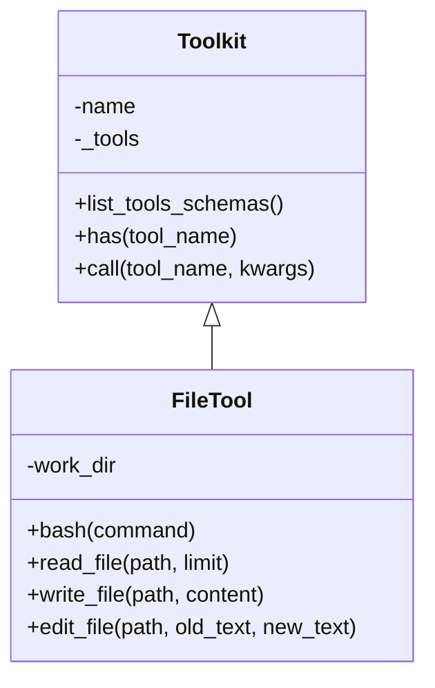

# FileTool：文件与命令执行工具

**代码**: https://github.com/jihe520/learn-agent

在 Agent 系统中，让 AI 能够读写文件、执行命令是非常基础的能力。FileTool 提供了这两大核心功能，同时注重安全性。

## 核心功能概览



FileTool 继承自 Toolkit，提供 4 个工具函数：
- `bash()` - 执行 Shell 命令
- `read_file()` - 读取文件内容
- `write_file()` - 创建/覆盖文件
- `edit_file()` - 精确替换文件内容

## 工作目录安全机制

FileTool 在初始化时指定 `work_dir`，所有文件操作都被限制在这个目录内，防止路径穿越攻击：

```python
def __init__(self, work_dir: str = "."):
    self.work_dir = os.path.abspath(work_dir)
```

```python
def _safe_path(self, p: str) -> Path:
    # 防止路径穿越攻击
    path = (Path(self.work_dir) / p).resolve()
    if not path.is_relative_to(Path(self.work_dir).resolve()):
        raise ValueError("Unsafe path detected.")
    return path
```

无论用户传入什么样的路径（如 `../../../etc/passwd`），都会被安全地限制在 `work_dir` 内。

## bash 命令执行

```python
def bash(self, command: str):
    """
    execute shell command. common patterns:
    - Read: cat/head/tail,grep/find/rg/ls,wc -l
    - Write: echo,>,>>,tee
    - Subagent: python claudecode.py 'task description'
    """
```

### 危险命令检测

```python
DANGER_COMMANDS = ["rm -rf /", "sudo", "shutdown", "reboot"]
if any(d in command for d in DANGER_COMMANDS):
    return "ERROR: Dangerous command detected. Aborting."
```

### 常见用法

```python
# 读取文件
agent.tools[0].bash("cat report.md")
agent.tools[0].bash("head -20 log.txt")
agent.tools[0].bash("grep -n 'error' app.log")

# 写入文件
agent.tools[0].bash("echo 'hello world' > test.txt")
agent.tools[0].bash("ls -la >> dir_list.txt")

# 查找文件
agent.tools[0].bash("find . -name '*.py'")
agent.tools[0].bash("rg -l 'def main' .")

# 调用子 Agent
agent.tools[0].bash("python claudecode.py '分析这个项目的结构'")
```

## read_file 读取文件

```python
def read_file(self, path: str, limit: int | None = None) -> str:
    """
    Read file contents with optional line limit.
    Output truncated to 50KB to prevent context overflow.
    """
```

### 特性
- 自动创建安全路径
- 支持行数限制（`limit` 参数）
- 输出限制在 50KB 内

```python
# 读取完整文件
content = agent.tools[0].read_file("data.csv")

# 只读取前100行
content = agent.tools[0].read_file("large_file.log", limit=100)
```

## write_file 写入文件

```python
def write_file(self, path: str, content: str) -> str:
    """
    Write content to file, creating parent directories if needed.
    """
```

### 特性
- 自动创建父目录
- 完整覆盖文件内容

```python
agent.tools[0].write_file("output/result.json", '{"status": "ok"}')
```

## edit_file 精确编辑

```python
def edit_file(self, path: str, old_text: str, new_text: str) -> str:
    """
    Replace exact text in a file (surgical edit).
    Uses exact string matching - the old_text must appear verbatim.
    Only replaces the first occurrence to prevent accidental mass changes.
    """
```

### 特性
- 精确字符串匹配（不是正则）
- 只替换第一个匹配项，防止误操作

```python
# 将配置文件中的端口号从 8080 改为 3000
agent.tools[0].edit_file(
    "config.yaml",
    "port: 8080",
    "port: 3000"
)
```

## 完整使用示例

```python
from learn_agent.tool.file_tool import FileTool

# 初始化（默认当前目录）
file_tool = FileTool("./project")

# 读取
print(file_tool.read_file("README.md"))

# 执行命令
print(file_tool.bash("ls -la"))

# 写入
file_tool.write_file("test.txt", "Hello World")

# 编辑
file_tool.edit_file("test.txt", "Hello", "Hi")
```

## 安全最佳实践

1. **始终使用相对路径** - 配合 `work_dir` 限制工作范围
2. **限制 Agent 的工作目录** - 不要让 Agent 有权限访问系统关键目录
3. **危险命令白名单** - FileTool 内置了基础检测，生产环境可考虑更严格的策略
4. **输出长度限制** - 50KB 限制防止上下文溢出

---

**代码**: https://github.com/jihe520/learn-agent
