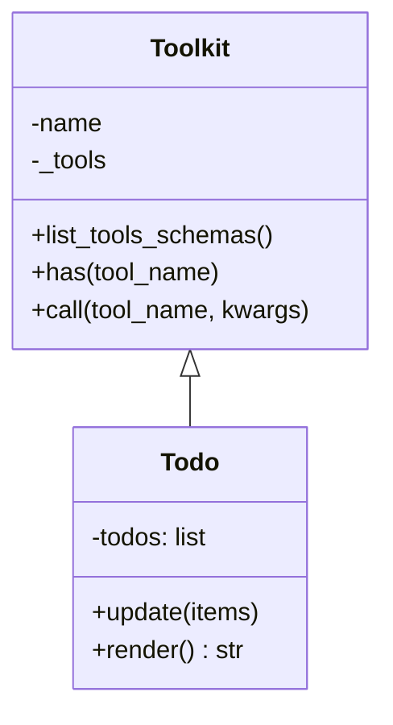

# TodoList：任务管理工具

**代码**: https://github.com/jihe520/learn-agent

TodoList 是 Agent 进行任务规划和进度追踪的核心工具。它帮助 Agent 将复杂任务拆解为可管理的步骤，并跟踪每个步骤的状态。

## 核心设计



## 数据结构

每个 todo item 包含三个必填字段：

| 字段 | 类型 | 说明 |
|------|------|------|
| `content` | string | 任务描述（简明扼要） |
| `status` | string | 状态：`pending` / `in_progress` / `completed` |
| `activeForm` | string | 进行时态的描述，如 "正在修复 bug" |

```python
{
    "content": "实现用户登录功能",
    "status": "pending",
    "activeForm": "实现用户登录功能"
}
```

## 核心方法

### update(items)

验证并更新 todo 列表。LLM 每次发送完整的任务列表，工具负责验证和持久化。

```python
def update(self, items: list) -> str:
    """
    Validate and update the todo list.
    """
```

#### 验证规则

```python
# 1. 每项必须有 content, status, activeForm
if not content:
    raise ValueError(f"Item {i}: content required")

# 2. 状态必须是 pending | in_progress | completed
if status not in ("pending", "in_progress", "completed"):
    raise ValueError(f"Item {i}: invalid status '{status}'")

# 3. 最多只能有一个 in_progress
if in_progress_count > 1:
    raise ValueError("Only one task can be in_progress at a time")

# 4. 最多20个任务
if len(validated) > 20:
    raise ValueError("Max 20 todos allowed")
```

### render()

将 todo 列表渲染为人类可读的文本，作为工具调用结果返回给模型：

```
[x] 完成的任务
[>] 进行中的任务 <- 正在做什么...

(3/5 completed)
```

| 符号 | 状态 |
|------|------|
| `[x]` | completed |
| `[>]` | in_progress（显示 activeForm） |
| `[ ]` | pending |

## 使用示例

```python
from learn_agent.tool.todo_tool import Todo

todo = Todo()

# Agent 第一次规划任务
todo.update([
    {"content": "设计数据库模型", "status": "in_progress", "activeForm": "设计数据库模型"},
    {"content": "实现 API 接口", "status": "pending", "activeForm": "实现 API 接口"},
    {"content": "编写单元测试", "status": "pending", "activeForm": "编写单元测试"},
])

# 输出:
# [>] 设计数据库模型 <- 正在设计数据库模型
# [ ] 实现 API 接口
# [ ] 编写单元测试
#
# (0/3 completed)

# 完成一项后更新
todo.update([
    {"content": "设计数据库模型", "status": "completed", "activeForm": "设计数据库模型"},
    {"content": "实现 API 接口", "status": "in_progress", "activeForm": "实现 API 接口"},
    {"content": "编写单元测试", "status": "pending", "activeForm": "编写单元测试"},
])

# 输出:
# [x] 设计数据库模型
# [>] 实现 API 接口 <- 正在实现 API 接口
# [ ] 编写单元测试
#
# (1/3 completed)
```

## 在 Agent 中使用

```python
from learn_agent.tool.todo_tool import Todo

# 初始化 Agent 时添加 Todo
agent = Agent(
    llm=DeepSeek(model="deepseek-chat"),
    tools=[FileTool(), Todo()],  # 添加 Todo
    memory=Memory(),
)

# Agent 自动规划任务
agent.run("帮我开发一个博客系统")
```

Agent 的典型工作流程：

1. **规划阶段** - Agent 收到任务，使用 `Todo.update()` 创建任务列表
2. **执行阶段** - Agent 逐个完成任务，调用其他工具
3. **更新阶段** - 每次工具调用后，更新 todo 状态
4. **完成阶段** - 所有任务标记为 completed

## 设计考量

### 为什么只有一个 in_progress？

保证同一时间专注于一件事，符合番茄工作法原理，也避免 Agent 并发调用工具导致状态混乱。

### 为什么每次发送完整列表？

LLM 具有完整的上下文记忆能力，每次发送完整列表简化了工具设计，不需要部分更新 API。

### activeForm 的作用

为进行中的任务提供更自然的描述，帮助 LLM 在工具结果中理解当前状态：

```
[>] 实现 API 接口 <- 正在实现 API 接口
```

## 与 Claude Agent SDK 的对比

| 特性 | 本实现 | Claude Agent SDK |
|------|--------|------------------|
| 状态字段 | content, status, activeForm | status, activeForm, content |
| 渲染格式 | 简洁文本 | 轻量级 UI |
| in_progress 限制 | 1个 | 1个 |
| 最大数量 | 20 | 无硬性限制 |

---

**代码**: https://github.com/jihe520/learn-agent
