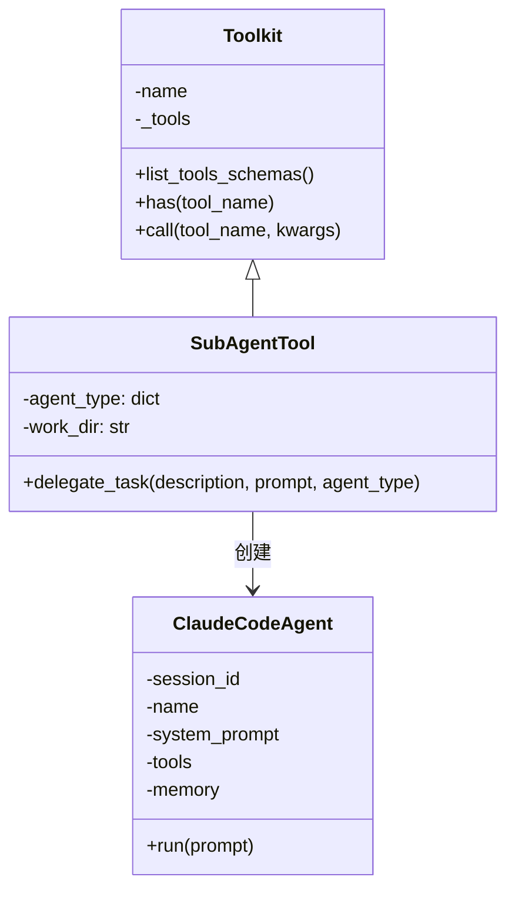

# SubAgentTool：子代理工具

**代码**: https://github.com/jihe520/learn-agent

SubAgentTool 是实现多代理协作的核心工具。它允许主 Agent 派生子代理执行特定任务，子代理拥有独立的上下文和工具集，互不干扰。

## 核心设计



## 为什么需要子代理？

### 问题：上下文污染

当一个 Agent 处理复杂任务时，如果所有子任务都在同一个上下文中：
- 对话历史越来越长
- LLM 难以区分主任务和子任务
- 工具调用历史混乱

### 解决方案：隔离上下文

```
┌─────────────────────────────────────────┐
│  Main Agent                             │
│  - 完整对话历史                         │
│  - 所有工具权限                         │
│                                         │
│  ┌─────────────────────────────────┐    │
│  │ SubAgent (explore)              │    │
│  │ - 独立上下文（无父代理历史）     │    │
│  │ - 有限的工具权限                 │    │
│  │ - 只返回最终结果摘要             │    │
│  └─────────────────────────────────┘    │
│                                         │
│  ┌─────────────────────────────────┐    │
│  │ SubAgent (plan)                 │    │
│  │ - 独立上下文                    │    │
│  │ - 特定工具                      │    │
│  └─────────────────────────────────┘    │
└─────────────────────────────────────────┘
```

## 核心机制

### 1. 隔离的上下文

```python
sub_agent = ClaudeCodeAgent(
    session_id="subagent_session",
    name=f"subagent_{agent_type}",
    system_prompt=sub_system_prompt,
    llm=DeepSeek(model="deepseek-chat"),
    tools=[],           # 空工具集，可按需配置
    memory=Memory(),    # 独立内存，无父代理历史
)
```

关键点：
- **无父代理历史** - `Memory()` 是全新实例
- **独立会话 ID** - 隔离追踪
- **可定制的工具** - 按 agent_type 过滤

### 2. 任务委派

```python
def delegate_task(self, description: str, prompt: str, agent_type: str) -> str:
    """
    Spawn a subagent for a focused subtask.

    Subagents run in ISOLATED context - they don't see parent's history.
    Use this to keep the main conversation clean.
    """
```

参数说明：

| 参数 | 类型 | 说明 |
|------|------|------|
| `description` | str | 任务简短描述（用于日志显示） |
| `prompt` | str | 详细的任务指令 |
| `agent_type` | str | 代理类型，决定使用哪个配置 |

### 3. Agent 类型配置

```python
agent_type = {
    "explore": {
        "system_prompt": "你是一个代码探索专家，善于分析代码结构和依赖关系..."
    },
    "plan": {
        "system_prompt": "你是一个任务规划专家，善于将复杂任务拆解为步骤..."
    },
    "code": {
        "system_prompt": "你是一个代码实现专家，善于高效地实现功能..."
    },
}
```

## 使用示例

### 1. 初始化 SubAgentTool

```python
from learn_agent.tool.subagent_tool import SubAgentTool

# 定义代理类型配置
agent_type_config = {
    "explore": {
        "system_prompt": "你是一个代码探索专家。分析用户请求的文件，输出简洁的发现。"
    },
    "plan": {
        "system_prompt": "你是一个任务规划专家。将复杂任务拆解为清晰的步骤列表。"
    },
    "code": {
        "system_prompt": "你是一个代码实现专家。直接编写高质量代码。"
    },
}

# 创建工具（可指定工作目录）
subagent_tool = SubAgentTool(
    agent_type=agent_type_config,
    work_dir="./project"
)
```

### 2. 在主 Agent 中使用

```python
from learn_agent.agent.claude_code_agent import ClaudeCodeAgent
from learn_agent.tool.file_tool import FileTool
from learn_agent.tool.subagent_tool import SubAgentTool

agent = ClaudeCodeAgent(
    session_id="main",
    name="main_agent",
    system_prompt="你是一个全能助手，善于委派任务给专家子代理。",
    llm=DeepSeek(model="deepseek-chat"),
    tools=[FileTool("./project"), subagent_tool],
    memory=Memory(),
)

# 主代理收到请求后，可以派生子代理
agent.run("分析项目结构，找出认证相关的文件")
```

### 3. 直接调用

```python
# 探索文件
result = subagent_tool.delegate_task(
    description="Find auth files",
    prompt="找出所有使用认证模块的文件，包括 jwt、oauth 等相关实现",
    agent_type="explore"
)

# 规划任务
result = subagent_tool.delegate_task(
    description="Design migration",
    prompt="设计一个数据库迁移方案，包括表结构调整和数据迁移步骤",
    agent_type="plan"
)

# 实现代码
result = subagent_tool.delegate_task(
    description="Implement login form",
    prompt="实现用户登录表单，包含邮箱验证、密码验证和记住我功能",
    agent_type="code"
)
```

## 执行流程

```
Main Agent
    │
    ▼
┌─────────────────────────────┐
│ delegate_task()             │
│ - 验证 agent_type           │
│ - 记录开始时间              │
└─────────────┬───────────────┘
              │
              ▼
┌─────────────────────────────┐
│ 创建 SubAgent               │
│ - 独立 Memory               │
│ - 定制 system_prompt        │
│ - 过滤工具集                │
└─────────────┬───────────────┘
              │
              ▼
┌─────────────────────────────┐
│ sub_agent.run(prompt)      │
│ - 完整的 Agent 执行流程     │
│ - 工具调用、内存管理        │
└─────────────┬───────────────┘
              │
              ▼
┌─────────────────────────────┐
│ 返回结果摘要                │
│ - 只返回最终文本            │
│ - 不包含中间过程            │
└─────────────┬───────────────┘
              │
              ▼
Main Agent (继续处理)
```

## 日志输出

运行时会显示进度信息，便于追踪：

```
[subagent:explore] starting task: Find auth files
[subagent:explore] completed task: Find auth files in 3.24s
```

格式：`[subagent:{agent_type}] {action} task: {description} in {duration}s`

## 设计考量

### 为什么只返回最终文本？

子代理的中间步骤（如思考过程、工具调用详情）对主代理没有价值。主代理只需要知道：
- 任务是否完成
- 结果是什么

这样保持主代理的对话历史简洁。

### 为什么需要 description？

description 用于日志显示和调试，让开发者清楚看到每个子代理在做什么。

### agent_type 的作用

允许：
- 不同子代理有不同的 system_prompt
- 不同子代理有不同的工具权限
- 运行时动态选择子代理类型

## 与其他方案的对比

| 特性 | SubAgentTool | 函数调用 | 并发执行 |
|------|--------------|----------|----------|
| 上下文隔离 | ✅ 完整 | ❌ 共享 | ❌ 共享 |
| 独立工具集 | ✅ 可配置 | ❌ 固定 | ❌ 固定 |
| 独立思考 | ✅ LLM 驱动 | ❌ 无 | ❌ 无 |
| 返回格式 | 文本摘要 | 结构化数据 | 各不相同 |
| 适用场景 | 复杂子任务 | 简单计算 | 并行查询 |

## 扩展方向

1. **工具过滤** - 根据 agent_type 过滤可用工具
2. **Pydantic 模型** - 使用 Pydantic 定义 task 输入模型
3. **流式输出** - 支持子代理结果的流式返回
4. **超时控制** - 为不同类型的子代理设置不同超时
5. **错误重试** - 子代理失败时自动重试

---

**代码**: https://github.com/jihe520/learn-agent
