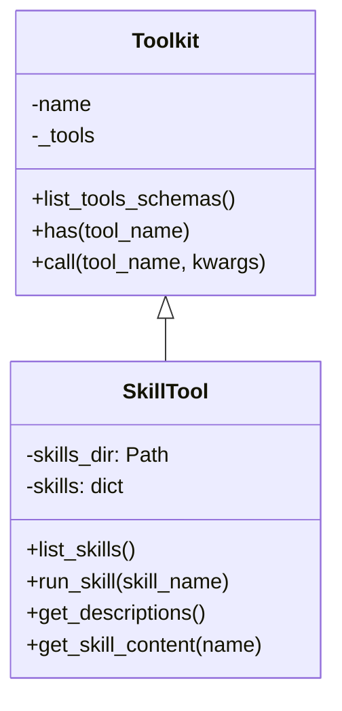

# SkillTool：技能工具

**代码**: https://github.com/jihe520/learn-agent

SkillTool 是基于 Claude Agent SDK 技能概念的重新实现，用于为 Agent 提供特定领域的专业知识和操作指南。

## 核心设计



## 为什么需要 SkillTool？

### 问题：领域知识注入

当 Agent 需要处理特定领域任务时（如 PDF 解析、MCP 协议），它需要：
- 详细的操作步骤
- 代码示例
- 注意事项

如果把这些都放进 system_prompt，会导致：
- prompt 过长
- 上下文浪费
- 更新困难

### 解决方案：技能模块化

```
skills/
├── pdf/
│   ├── SKILL.md          # 技能定义
│   ├── scripts/          # 辅助脚本
│   ├── references/       # 参考文档
│   └── assets/           # 资源文件
├── mcp/
│   ├── SKILL.md
│   └── ...
└── bash/
    └── SKILL.md
```

## SKILL.md 文件格式

每个技能目录必须包含一个 `SKILL.md` 文件，使用 YAML frontmatter 定义元数据：

```markdown
---
name: pdf
description: Extract and process PDF documents using pypdf
---

# PDF Processing Skill

## Overview
This skill provides capabilities for extracting text, images, and metadata from PDF files.

## Usage
When the user wants to:
- Extract text from PDF → use `read_file` and parse the content
- Extract images → use Python with pypdf library
- Get metadata → use `bash` with `pdfinfo` command

## Examples
```python
import pypdf
reader = pypdf.PdfReader("document.pdf")
text = "\n".join(page.extract_text() for page in reader.pages)
```

## Best Practices
1. Always handle exceptions for encrypted PDFs
2. Large files may require chunked reading
3. Check page count before processing
```

## 三层架构

```mermaid
graph LR
    A[Tool Schema] --> B[Layer 1: Metadata]
    B --> C[Layer 2: Full Content]
    C --> D[Layer 3: Resources]

    B --- "name + description<br/>~100 tokens/skill"
    C --- "SKILL.md body<br/>按需加载"
    D --- "scripts/references/assets<br/>路径提示"
```

### Layer 1: 元数据（始终可用）

```python
def get_descriptions(self) -> str:
    """
    Generate skill descriptions for system prompt.
    This is Layer 1 - only name and description, ~100 tokens per skill.
    """
    return "\n".join(
        f"- {name}: {skill['description']}" for name, skill in self.skills.items()
    )
```

输出示例：
```
- pdf: Extract and process PDF documents using pypdf
- mcp: Connect to Model Context Protocol servers
- bash: Execute shell commands safely
```

### Layer 2: 完整内容（按需加载）

```python
def get_skill_content(self, name: str) -> str:
    """Get full skill content for injection."""
    skill = self.skills[name]
    content = f"# Skill: {skill['name']}\n\n{skill['body']}"
    return content
```

只有当 Agent 调用 `run_skill` 时才会加载完整内容。

### Layer 3: 资源提示

```python
# 列出可用资源
for folder, label in [
    ("scripts", "Scripts"),
    ("references", "References"),
    ("assets", "Assets"),
]:
    folder_path = skill["dir"] / folder
    if folder_path.exists():
        files = list(folder_path.glob("*"))
        if files:
            resources.append(f"{label}: {', '.join(f.name for f in files)}")
```

输出示例：
```
**Available resources in /path/to/skills/pdf:**
- Scripts: extract_text.py, extract_images.py
- References: pypdf_docs.md
```

## 核心方法

### list_skills()

```python
def list_skills(self) -> list:
    """Return list of available skill names."""
    return list(self.skills.keys())
```

### run_skill(skill_name)

```python
def run_skill(self, skill_name: str) -> str:
    """
    Load a skill to gain specialized knowledge for a task.

    The skill content will be injected into the conversation,
    giving you detailed instructions and access to resources.
    """
    content = self.get_skill_content(skill_name)

    # 用 XML 标签包裹，便于识别
    return f"""<skill-loaded name="{skill_name}">
                {content}
                </skill-loaded>

                Follow the instructions in the skill above to complete the user's task.
                """
```

## 使用示例

### 1. 创建技能目录

```bash
mkdir -p skills/pdf/scripts
mkdir -p skills/pdf/references
```

### 2. 编写 SKILL.md

```markdown
---
name: pdf
description: Extract and process PDF documents
---

# PDF Processing Skill

Use pypdf to work with PDF files.

## Extract Text
```python
import pypdf
reader = pypdf.PdfReader("file.pdf")
text = "\n".join(page.extract_text() for page in reader.pages)
```

## Best Practices
- Handle encrypted PDFs
- Use chunked reading for large files
```

### 3. 添加辅助脚本

```python
# skills/pdf/scripts/extract_text.py
import pypdf
import sys

def extract_pdf_text(path):
    reader = pypdf.PdfReader(path)
    return "\n".join(page.extract_text() for page in reader.pages)

if __name__ == "__main__":
    print(extract_pdf_text(sys.argv[1]))
```

### 4. 在 Agent 中使用

```python
from pathlib import Path
from learn_agent.tool.skill_tool import SkillTool

skill_tool = SkillTool(skills_dir=Path("./skills"))

agent = ClaudeCodeAgent(
    session_id="main",
    name="assistant",
    system_prompt=f"""You are a helpful assistant.

    Available skills:
    {skill_tool.get_descriptions()}
    """,
    llm=DeepSeek(model="deepseek-chat"),
    tools=[skill_tool, FileTool("./project")],
    memory=Memory(),
)

# Agent 检测到需要 PDF 处理，自动加载技能
agent.run("从 report.pdf 中提取所有文本")
```

## 技能设计最佳实践

### 1. 保持描述简洁

```yaml
# ✅ 好
name: pdf
description: Extract and process PDF documents using pypdf

# ❌ 不好
name: pdf
description: This skill allows you to extract text from PDF files using the powerful pypdf library which supports various PDF versions and encryption methods...
```

### 2. 提供具体示例

```markdown
## Usage
```python
import pypdf
reader = pypdf.PdfReader("document.pdf")
text = reader.pages[0].extract_text()
```
```

### 3. 包含注意事项

```markdown
## ⚠️ Important
- Encrypted PDFs will raise an exception
- Large files (>100MB) may cause memory issues
```

## 常见问题

### Q: Agent 什么时候应该调用 run_skill？

A: 当用户任务匹配技能描述时，立即调用：
```
User: "从 PDF 提取图片"
→ match: "pdf: Extract and process PDF documents"
→ call: run_skill("pdf")
```

### Q: 可以同时加载多个技能吗？

A: 可以。Agent 可以多次调用 `run_skill` 加载不同技能，技能内容会累积注入上下文。

### Q: 技能文件更新后需要重启吗？

A: 目前需要重启。可以在 `_load_skills()` 中添加文件监控实现热重载。

## 扩展方向

1. **热重载** - 监听 skills_dir 变化，自动重新加载
2. **技能依赖** - 支持声明技能间的依赖关系
3. **版本管理** - 支持技能版本控制
4. **条件加载** - 根据运行时条件决定是否加载
5. **技能组合** - 支持将多个技能合并为一个
